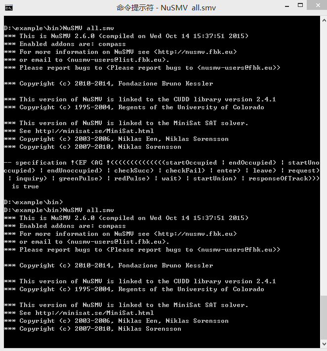

# step 0: timing constraints changes in PF-CCSL （snap from XText）


# step 1: problem description of Interlocking System

1. When the train enters the track, it sends a request signal to the control center and waits for the traffic light signal.
2. After receiving the query result signal "result", the control center sends the detecting occupancy signal "checkoccupied" to the track to detect the occupation of the track.
3. After receiving the detecting occupancy signal, the track check whether the track is occupied. If the track is occupied, it sends the occupied signal "occupied" to the control center. If not occupied, it sends the unoccupied  signal "unoccupied". When the train receiving the signal "trainEnter", the track is set to be occupied, and the track condition is not occupied when the train sends the train departure signal "trainLeave".
4. If the track is unoccupied, the control center sends the green pulse signal to the signal light. If the track is occupied, the control center sends the red pulse signal to the signal light.
5. The initial state of the signal Light is red light. After receiving the green pulse, it becomes a green light state. After receiving the red pulse, it becomes a red light state. 
6. If the train sees the red light, it will wait. If the train sees the green light, it will enter, and finally leaves the station. 
7. After the train sends the request, the train will wait or enter will be in 50 ms. 
8. The response time of the light is 30 ms. 
9. From checking the state of track to the set light, the time bound in 40 ms. 

# step 2: Timing requirements and physical world description of Interlocking system in PF-CCSL


# Step 3: change

Signal light changes: 
The constraints in line 18, 19 changes to:

greenPulse boundedDiff_0_20 showGreen,
redPulse boundedDiff_0_20 showRed,

# step 4: model checking of satisfaction property 

1. The model checking file .smv

```
MODULE main
VAR
startOccupied:boolean;
endOccupied:boolean;
startUnoccupied:boolean;
endUnoccupied:boolean;
checkSucc:boolean;
checkFail:boolean;
responseOfTrack:boolean;
enter:boolean;
leave:boolean;
request:boolean;
inquiry:boolean;
greenPulse:boolean;
redPulse:boolean;
wait:boolean;
startUnion:boolean;
responseOfTrain:boolean;
showGreen:boolean;
showRed:boolean;


ctr1:unionn(checkSucc,checkFail,responseOfTrack);
ctr2:boundeddiff(inquiry,responseOfTrack,0,30);
ctr3:strictpre(inquiry,responseOfTrack,5);
ctr4: coincidence(enter,startOccupied);
ctr5: coincidence(leave,startUnoccupied);
ctr6: Alter(startOccupied,startUnoccupied);

ctr7:unionn(enter,wait,responseOfTrain);
ctr8:Alter(request,responseOfTrain);
ctr9:strictpre(showRed,wait,5);
ctr10:strictpre(showGreen,enter,5);
ctr11:strictpre(enter,leave,5);
ctr12:boundeddiff(request,responseOfTrain,0,50);

ctr13:exclusion(showRed,showGreen);
ctr14:cause(greenPulse,showGreen,5);
ctr15:cause(redPulse,showRed,5);
ctr16:boundeddiff(redPulse,showRed,0,30);
ctr17:boundeddiff(greenPulse,showGreen,0,30);

ctr18:strictpre(checkFail,redPulse,5);
ctr19:strictpre(checkSucc,greenPulse,5);
ctr20:boundeddiff(checkFail,showRed,0,40);
ctr21:boundeddiff(checkSucc,showGreen,0,40);
ctr22:strictpre(request,inquiry,5); 
ctr23:strictpre(showGreen,enter,5);
ctr24:strictpre(showRed,wait,5);
ctr25:strictpre(inquiry,responseOfTrack,5);

ctr26:exclusion(redPulse,greenPulse);


ASSIGN
init(startOccupied):=FALSE;
init(endOccupied):=FALSE;
init(startUnoccupied):=FALSE;
init(endUnoccupied):=FALSE;
init(checkSucc):=FALSE;
init(checkFail):=FALSE;
init(enter):=FALSE;
init(leave):=FALSE;
init(request):=FALSE;
init(inquiry):=FALSE;
init(greenPulse):=FALSE;
init(redPulse):=FALSE;
init(wait):=FALSE;
init(responseOfTrain):=FALSE;
init(startUnion):=FALSE;
init(responseOfTrack):=FALSE;
init(showRed):=TRUE;
init(showGreen):=FALSE;

CTLSPEC (! EF AG !(startOccupied|endOccupied|startUnoccupied|endUnoccupied|checkSucc|checkFail|enter|leave|request|inquiry|greenPulse|redPulse|wait|startUnion|responseOfTrack))   

MODULE strictpre(left,right,n)
VAR
	coun:0..n;
INIT
	coun=0;
TRANS
case
	coun=0: (next(left)=TRUE & next(right)=FALSE & next(coun)=coun+1)|(next(left)=FALSE & next(right)=FALSE & next(coun)=coun);
	coun<n: (next(left)=TRUE & next(right)=FALSE & next(coun)=coun+1)|(next(left)=TRUE & next(right)=TRUE & next(coun)=coun)|(next(left)=FALSE & next(right)=TRUE & next(coun)=coun - 1)|(next(left)=FALSE & next(right)=FALSE & next(coun)=coun);
	TRUE: (next(left)=TRUE & next(right)=TRUE & next(coun)=coun)|(next(left)=FALSE & next(right)=TRUE & next(coun)=coun - 1)|(next(left)=FALSE & next(right)=FALSE & next(coun)=coun);
esac


MODULE unionn(left,right,new)
TRANS
	(next(left)=TRUE & next(new)=TRUE)|(next(right)=TRUE & next(new)=TRUE)|(next(left)=FALSE & next(right)=FALSE & next(new)=FALSE)

MODULE boundeddiff(left,right,i,j)
VAR
dif: i..j;
INIT
dif=0
TRANS
case
dif=j:((next(left)=FALSE&next(right)=TRUE&next(dif)=dif - 1) | (next(left)=TRUE&next(right)=TRUE&next(dif)=dif) | (next(left)=FALSE&next(right)=FALSE&next(dif)=dif));
dif=i:((next(left)=TRUE&next(right)=FALSE&next(dif)=dif+1) | (next(left)=TRUE&next(right)=TRUE&next(dif)=dif) | (next(left)=FALSE&next(right)=FALSE&next(dif)=dif));
TRUE:(next(left)=TRUE&next(right)=FALSE&next(dif)=dif+1) | (next(left)=FALSE&next(right)=TRUE&next(dif)=dif - 1) | (next(left)=TRUE&next(right)=TRUE&next(dif)=dif) | (next(left)=FALSE&next(right)=FALSE&next(dif)=dif);
esac

MODULE cause(left,right,n)
VAR
scnt:0..n;
INIT
scnt=0
TRANS
case
scnt=0:((next(left)=TRUE&next(right)=FALSE&next(scnt)=scnt+1) | (next(left)=FALSE&next(right)=FALSE&next(scnt)=scnt) | (next(left)=TRUE&next(right)=TRUE&next(scnt)=scnt));
scnt>0&scnt<n:(next(left)=TRUE&next(right)=FALSE&next(scnt)=scnt+1) | (next(left)=TRUE&next(right)=TRUE&next(scnt)=scnt) | (next(left)=FALSE&next(right)=TRUE&next(scnt)=scnt - 1) | (next(left)=FALSE&next(right)=FALSE&
next(scnt)=scnt);
scnt=n:(next(left)=TRUE&next(right)=TRUE&next(scnt)=scnt) | (next(left)=FALSE&next(right)=TRUE&next(scnt)=scnt - 1) | (next(left)=FALSE&next(right)=FALSE&next(scnt)=scnt);

esac 

MODULE coincidence(left,right)
TRANS
next(left)->next(right)&next(right)->next(left)

MODULE subclock(left,right)
TRANS
      next(left)->next(right)

MODULE delay(left,right,k)
VAR
	cnt:0..k;
INIT
	cnt=0;
TRANS
case
	cnt<k: next(left)=FALSE & ((next(right)=TRUE & next(cnt)=cnt+1)|(next(right)=FALSE & next(cnt)=cnt));
	cnt=k|cnt>k: (next(left)=TRUE & next(right)=TRUE & next(cnt)=cnt)|(next(left)=FALSE & next(right)=FALSE & next(cnt)=cnt);

esac

MODULE exclusion (left, right)
TRANS
(next (left)=TRUE & next (right)=FALSE) | (next(left)=FALSE & next (right)=TRUE)| (next(left)=FALSE & next (right)=FALSE);

MODULE Alter(left,right)
VAR
	state:boolean;
INIT
	state=FALSE;
TRANS
case
    state = FALSE :  (next(right)=FALSE & next(left)=TRUE  & next(state) = TRUE )|(next(right)=FALSE & next(left)=FALSE & next(state)=FALSE);
    state = TRUE :  (next(left)=FALSE & next(right)=TRUE  & next(state) = FALSE)|(next(left)=FALSE & next(right)=FALSE & next(state)=TRUE);

esac
```

2. verification result 




# step 5: Specification derivation 


